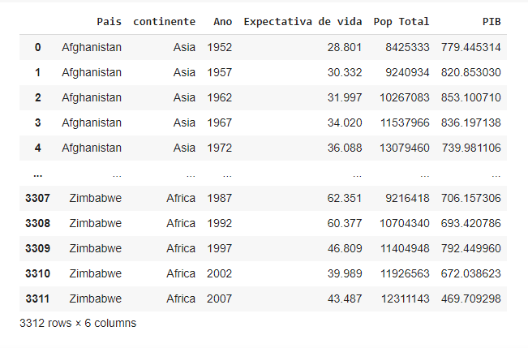

###### Python_Pandas_Data_Analysis_Data_Engineer_Matplotlib_Colab_Research_Google_Jupyter_Notebook
# Python Pandas Data Analysis Data Engineer Matplotlib Colab Research Google Jupyter Notebook

### Análise de dados de uma planilha contendo dados como Pais, continente, Ano, Expectativa de vida, População Total, e PIB per capita.
### Usando Pandas é possível extrair informações como a expectativa de vida média para cada ano, entre outras informações.

        TIP:
        no Jupyter Notebook ou no Colab,
        aperte SHIFT + ENTER
        para executar esta linha de comando e automáticamente abre outra linha de comando.

###### Tabela parcial: Dados iniciais e finais
<!--  DESSE JEITO APENAS PÕE A IMAGEM MAS NÃO ALINHA-->

    

