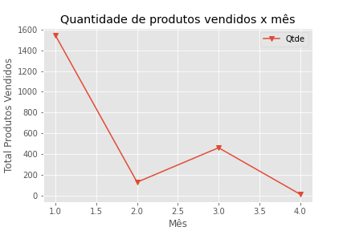

###### Python_Pandas_Data_Analysis_Data_Engineer_Matplotlib_Colab_Research_Google_Jupyter_Notebook
# Python Pandas Data Analysis Data Engineer Matplotlib Colab Research Google Jupyter Notebook

### Análise de dados de planilhas e arquivos.CSV contendo dados como Pais, continente, Ano, Expectativa de vida, População Total, PIB per capita, Marca, Data venda, Lucro, Custo, Desconto, Fabricante, Data Venda, Data envio.
### Usando a biblioteca Pandas é possível extrair informações como:

- contabilizar a expectativa de vida média de uma população para cada ano
- filtrar as vendas por data específica
- fazer agrupamentos assim como na instrução GROUP BY do SQL
- calcular a Média do tempo de envio de determinado prodoto agrupados por Marca
- Exibir resultados em Gráficos
- exportar resultados para um .CSV, planilha, ou imagens gráficas
- e muito mais

        TIP:
        no Jupyter Notebook ou no Colab,
        aperte SHIFT + ENTER
        para executar esta linha de comando e automáticamente abre outra linha de comando.

<!-- ###### Tabela parcial: Dados iniciais e finais -->

<!--  DESSE JEITO APENAS PÕE A IMAGEM MAS NÃO ALINHA -->

    Tabela parcial: Dados iniciais e finais
        

     Gráfico exemplo 
    

# Gráficos

    <a href="https://matplotlib.org/">Matplotlib</a>

# Pandas library

    <a href="https://pandas.pydata.org/">Matplotlib</a>

